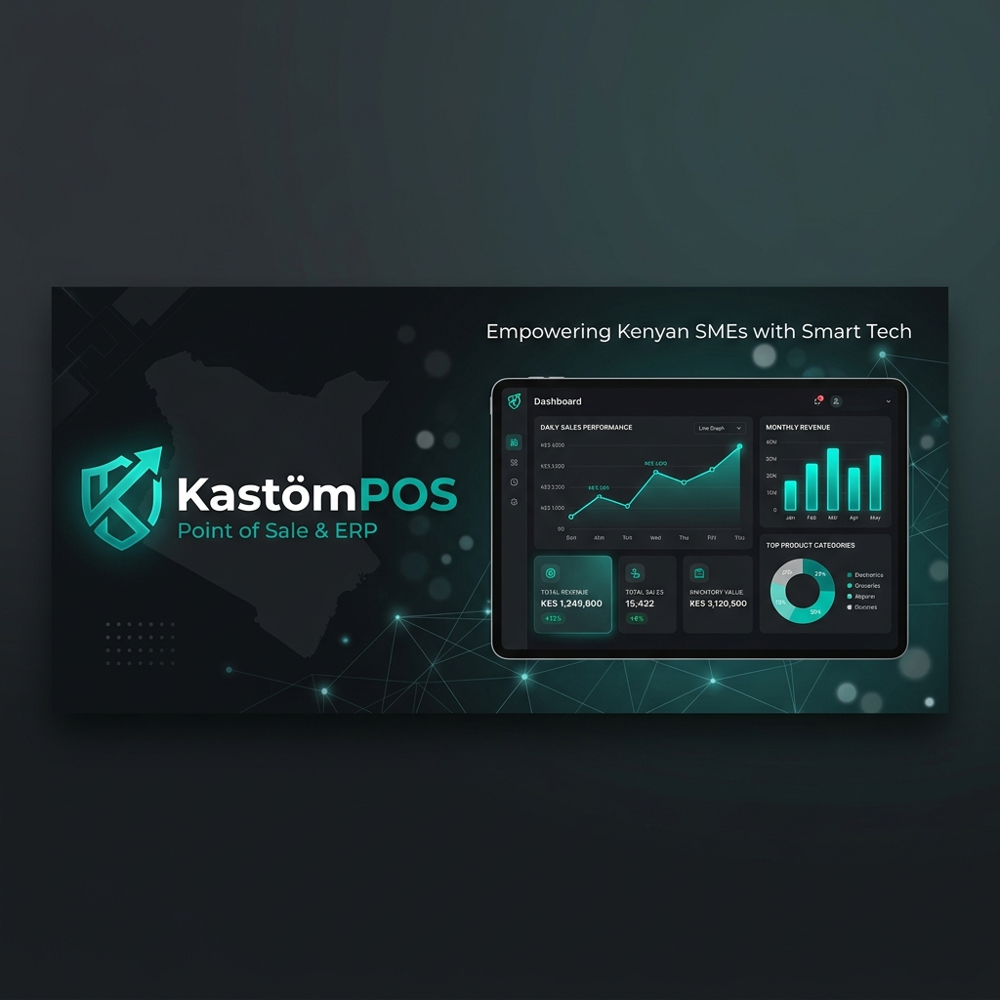
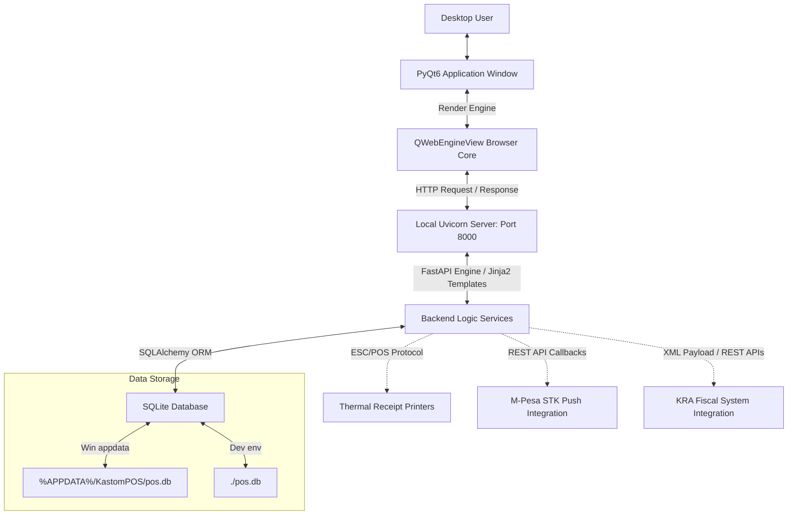
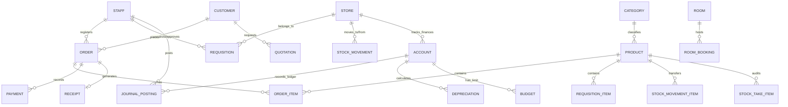

# 

# KastomPOS (ERP & Point of Sale)

> **Empowering Kenyan SMEs with Enterprise-Grade, Offline-First Smart POS & Double-Entry Bookkeeping.**

**KastomPOS** is a hybrid desktop-and-web Enterprise Resource Planning (ERP) and Point of Sale (POS) system designed specifically for Kenyan SMEs (Retail shops, Restaurants, Hotels, and Service Providers). By wrapping a high-performance **FastAPI** backend within a secure **PyQt6 QWebEngineView** native desktop shell, KastomPOS offers the reliability of a local offline desktop application with the rich UI capability of modern web applications.

---

## 🏗️ System Architecture

KastomPOS uses a hybrid client-server desktop architecture. It boots a local `uvicorn` web server running the FastAPI backend on a separate thread, and binds a native PyQt6 application window to display the interface locally.



---

## 📊 Database Schema Relationships

KastomPOS features a highly structured, relational SQLite database managed via SQLAlchemy. Below is a map of the core relational structures:



---

## ✨ Features Breakdown

### 🛒 1. Point of Sale & Billing
* **Multi-Station Attendants**: Flexible waiter and cashier assignment per order.
* **Table Management**: Map bills and orders to designated tables or rooms.
* **Void Protection & Controls**: Security logs containing authorization records for deleted/modified order items.
* **Flexible Payments**: Support split bills using cash, card, bank transfers, and M-Pesa.
* **Receipt Customization**: Local header/footer controls and automatic print job routing.

### 🏨 2. Hotel & Accommodation Bookings
* **Interactive Bookings Calendar**: Visual grid layout representing room occupancies, reservations, and stays.
* **Room Cleaning States**: Real-time room status tracker (Available, Occupied, Maintenance, Cleaning).
* **Meal Plans & Revenue Allocations**: Set bookings to Bed Only, Bed & Breakfast (BB), Half Board (HB), or Full Board (FB) with automatic revenue allocation splits across accommodation, food, and beverage categories.

### 💼 3. Double-Entry ERP Bookkeeping
* **Comprehensive Chart of Accounts**: Group asset, liability, equity, revenue, and expense accounts.
* **Double-Entry Journal Entries**: Post manual debits and credits directly into the general ledger.
* **Core Financial Reporting**: Complete generator for **Balance Sheets**, **Profit & Loss Statements**, **Cash Flows**, and **Trial Balances**.
* **Fixed Assets & Depreciation**: Log company assets and run automated straight-line depreciation postings.
* **Budget Tracking**: Monitor quarterly operational budgets against ledger accounts.

### 📦 4. Multi-Store Inventory & Supply Chain
* **Multi-Store Management**: Track stock balances across different physical store departments (e.g., Main Store, Kitchen, Bar).
* **Stock Movements & Requisitions**: Formal internal stock transfer logs and authorization pipelines.
* **Stock Takes & Reconciliation**: Track expected vs. actual counts, calculate stock variances, and reconcile values.
* **Wastage Ledger**: Log spoilt inventory and write off costs directly against expense accounts.
* **Serialized Stock**: Track unique electronic assets and serial numbers.
* **Local Purchase Orders (LPOs)**: Create purchase orders, manage suppliers, and schedule bills.

### 🔗 5. Localized Integrations
* **M-Pesa Callback Handling**: Monitor and log incoming STK push responses, matching till/paybill payments to active orders.
* **KRA Fiscal Receipts**: Ready-to-bind KRA control number mappings for official tax compliance.
* **Thermal Receipt Printing**: Integrated IP/Port ESC/POS networking driver.

### 👥 6. Human Resources & Payroll
* **Payroll Processing**: Auto-calculate allowances, deductions, payroll advances, basic salaries, and generate KES tax statements (P9).
* **HR Actions Logs**: Record staff resignations, terminations, formal warning history, and awards.

---

## 🚀 Getting Started

### 📋 Prerequisites
* **Python 3.10 or 3.11** (PyQt6-WebEngine is compatible with Python <= 3.11; avoid 3.12+ for older packages).
* **Platform Support**: Works on macOS, Windows, and Linux.

### 🔧 Setup & Installation

1. **Clone the repository**:
   ```bash
   git clone https://github.com/Akubrecah/KastomPOS.git
   cd KastomPOS
   ```

2. **Initialize a virtual environment**:
   ```bash
   python3 -m venv .venv
   source .venv/bin/activate  # On Windows: .venv\Scripts\activate
   ```

3. **Install Dependencies**:
   ```bash
   pip install -r requirements.txt
   ```

4. **Launch the Application**:
   ```bash
   python main.py
   ```
   *Note: On startup, if the local SQLite database is missing or empty, the application will automatically initialize the schema and seed demo records.*

---

## 🔑 Default Credentials

The following pre-configured credentials can be used to log in immediately upon fresh database installation:

| Username | Password | Role / Access Level |
| :--- | :--- | :--- |
| `admin` | `password123` | Full ERP Settings, Reports & Controls |
| `cashier1` | `password123` | Billing, Cashier Management, and Stock-take |
| `waiter1` | `password123` | Order Taker (Waitstaff Access) |

---

## 📦 Packaging for Production (Windows App)

Since cross-compiling is not supported (you cannot compile a Windows executable directly from macOS/Linux), a **GitHub Actions** workflow is configured to automatically package and build the Windows artifacts.

### CI/CD Workflow (Automatic Build)
1. Commit and push your changes to the `main` branch.
2. Under the **Actions** tab on GitHub, click **Build Windows Application** and select **Run workflow**.
3. Download the compiled executable and setup wizard from the action run artifacts.

### Local Compilation (Windows Environment Only)
To package the app into a single `.exe` locally on a Windows PC:

1. Install Windows-specific dependencies:
   ```bash
   pip install -r requirements_win.txt
   ```

2. Compile the standalone executable:
   ```bash
   python build_exe.py
   ```
   *This triggers PyInstaller to package the PyQt6 wrapper, FastAPI server, static files, and templates into `dist/KastomPOS.exe`.*

3. Generate the installer setup:
   * Download and install **Inno Setup** compiler.
   * Right-click `installer.iss` in the project root and select **Compile**.
   * The installer wizard (`KastomPOS_Setup.exe`) will be generated inside the `dist/` directory.

> [!IMPORTANT]
> **Production Data Directory**  
> To protect customer transaction history during app updates or uninstalls, the production `.exe` automatically redirects the SQLite database location to the user's roaming directory: `%APPDATA%/KastomPOS/pos.db`.

---

## 🛠️ Troubleshooting

* **Microsoft Visual C++ Runtime**: If the application crashes immediately on start on Windows, install the latest [Visual C++ Redistributable](https://aka.ms/vs/17/release/vc_redist.x64.exe).
* **Port Conflict**: KastomPOS defaults to port `8000` for the local API. If you have another application (like a local Django/FastAPI development server) running on port `8000`, close it before launching KastomPOS.
* **Antivirus False Positives**: Packaged PyInstaller executables are sometimes flagged as suspicious by Windows Defender because they lack a digital signature. You can add a file exclusion in your Antivirus or sign the compiled binary with a code signing certificate.
